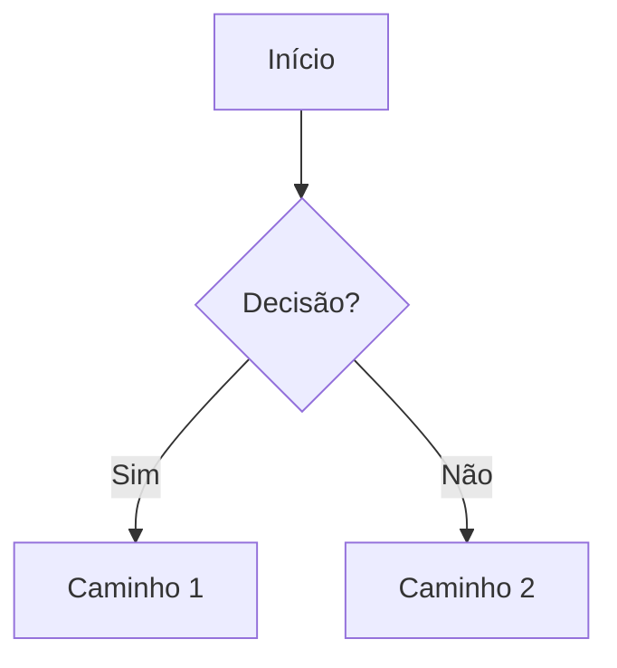

# Obsidian Patterns — padrão da smart-memory

Toda escrita em `docs/smart-memory/` segue este padrão. É a referência canônica usada pelos
agentes (architect, researcher, data, ux, qa) ao gravar conhecimento. Espelha o schema completo
em `team-os-creator/reference/smart-memory-integration.md`.

## 0. Princípio: estado, não histórico

A smart-memory guarda **o estado atual e as decisões** — não a narrativa de como se chegou lá.
Antes de escrever, pergunte: *"isso muda decisões futuras?"* Se não, não entra (ou vai direto
ao `_archive/`). Evidência bruta (dumps de query, logs, transcrições) **nunca** entra no
working set — fica no PR/código ou vai ao `_archive/`.

## 1. Frontmatter obrigatório

Todo `.md` em `docs/smart-memory/` começa com YAML:

```yaml
---
title: "..."
kind: reference | episode | digest    # ← ciclo de vida (ver §1.1)
type: overview | story | decision | research | qa-result | schema | task-log | backlog | status-board | index | component-spec
status: active | resolved | superseded | backlog | done | deprecated | proposed | accepted
supersedes: "[[nota-anterior]]"       # quando esta nota substitui outra
summary: >                            # 1-2 linhas — alimenta o DIGEST da área
  Conclusão essencial da nota em linguagem direta.
agent: <nome-do-agente>
created: YYYY-MM-DD
updated: YYYY-MM-DD
tags: [...]
related: ["[[...]]", "[[...]]"]
---
```

### 1.1 `kind` — os três tipos de nota

| `kind` | O que é | Ciclo de vida |
|---|---|---|
| `reference` | Conhecimento vivo: schema-map, metric-dictionary, conventions, specs vigentes | **Atualizada in-place**, nunca arquivada. `status: active` sempre. |
| `episode` | Trabalho pontual: audit, investigation, fix, plano, QA de uma rodada | Nasce `active` → vira `resolved` (concluído) ou `superseded` (substituído). **Resolved/superseded = candidata automática ao `_archive/`** no próximo `*compact`. |
| `digest` | Resumo vivo de uma área (`DIGEST.md`) | Atualizada in-place a cada episódio novo. Nunca arquivada. |

### 1.2 Regras de escrita enxuta (anti-inchaço)

1. **Update-in-place, não append.** Round 2 de uma investigação **atualiza a nota existente**
   (e registra 1 linha num mini-changelog no corpo) — não cria `investigation-round2.md`.
   Proibido sufixo de versão em nome de arquivo (`-r3`, `-v2`, `-final`).
2. **Teto de ~300 linhas por episódio.** Conclusões e decisões na nota; o que passar disso
   é apêndice → direto no `_archive/` com wikilink.
3. **Ao concluir um episódio**: marque `status: resolved` no frontmatter e atualize a linha
   dele no `DIGEST.md` da área. Se ele substitui nota anterior, marque a antiga
   `status: superseded` e aponte `supersedes` na nova.
4. **`summary` é obrigatório em episódios** — são as 1-2 linhas que sobrevivem no DIGEST
   quando o corpo for arquivado.

## 2. Wikilinks

- Navegação SEMPRE por wikilink `[[arquivo]]` — nunca link relativo cru no corpo.
- Atualizar `docs/smart-memory/INDEX.md` (MOC raiz) ao criar arquivo novo.
- Ao criar/resolver episódio, atualizar também o `DIGEST.md` da área.

## 3. Tags canônicas (não inventar)

`#project` · `#architecture` · `#story` · `#decision` · `#research` · `#qa` · `#database` · `#ux` · `#security` · `#performance` · `#task-log`

## 4. Datas

ISO 8601 (`YYYY-MM-DD`) — nunca relativas ("ontem", "semana passada").

## 5. Diagramas

Mermaid no corpo, em bloco ```mermaid```. Usado em ADRs (arquitetura) e user flows (UX).



## 6. Frontmatter por tipo (exemplos)

### ADR (`type: decision`)
```yaml
---
title: "ADR-{N}: {Título}"
type: decision
status: proposed | accepted | deprecated
agent: {architect}
created: YYYY-MM-DD
updated: YYYY-MM-DD
tags: [architecture, {domínio}]
related: ["[[../agents/research/{tema}]]"]
---
```

### Research report (`type: research`)
```yaml
---
title: "Research: {tema}"
type: research
agent: {researcher}
created: YYYY-MM-DD
updated: YYYY-MM-DD
tags: [research, {domínio}]
related: ["[[../../decisions/ADR-{N}]]"]
---
```

### Story → ver `team-os/templates/story.md`.
### DIGEST de área → ver `team-os/templates/digest.md`.

## 7. Anti-patterns

- Não misturar responsabilidades de escrita (ex.: architect não escreve `tech-stack.md` — é do analyst/researcher).
- Não deixar arquivo órfão: sempre referenciar no `INDEX.md` (e no `DIGEST.md` da área, se episódio).
- Não escrever conhecimento canônico fora de `docs/smart-memory/`.
- Não criar arquivo novo para nova rodada do mesmo tópico — atualizar a nota existente (§1.2).
- Não colar evidência bruta (dumps, logs, saídas longas) no working set — `_archive/` ou fora.
- Não ler `_archive/` nem pastas inteiras de outras áreas — a porta de entrada é o DIGEST.
