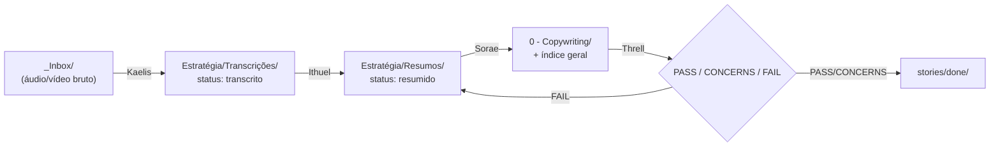

# Arquitetura — Resumos-Aulas-Gold

Pipeline de conteúdo, não arquitetura de software. Cada aula percorre 4 estágios, um por agente:

## Estágios

1. **Kaelis (edu-transcritor)** — organiza a transcrição bruta, renomeia (`AAAA-MM-DD - Professor - Curso - Tema.md`), classifica a Estratégia, arquiva.
2. **Ithuel (edu-sintetizador)** — lê a transcrição, extrai conceitos/frameworks/exemplos, escreve o resumo em `Resumos/`, linka via wikilink.
3. **Sorae (edu-bibliotecario)** — compila conteúdo de copy cross-tema em `0 - Copywriting/`, mantém o índice geral e a taxonomia de pastas, remapeia conteúdo do `_Projeto-Antigo/`.
4. **Threll (edu-qa)** — valida nomenclatura, fidelidade ao original, links e duplicidade; emite veredicto e move a story para `done/`.

Rastreamento de progresso: cada aula é uma story em `docs/smart-memory/stories/{backlog,active,in-review,done}/` — ver [[../stories/BACKLOG]].
